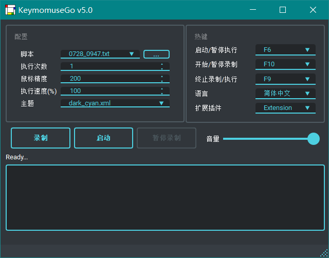

<div align="center">

# KeymouseGo

<br>

<div>
    
</div>
<div>
    
    
    
</div>
<div>
    <a href="https://deepwiki.com/taojy123/KeymouseGo">
        
    </a>
</div>
<br>

[简体中文](README.md) | [English](README_en-US.md)

</div>

Features:
  + Record mouse/keyboard operations
  + Reproduce operations recorded before
  + Can be regarded as simplified *Quick Macro*

Usage:
  + Free users away from works that are simple and repetitive
  + You can record the necessary operations once and left the rest of works to computer


# Table of content

- [KeymouseGo](#keymousego)
- [Table of content](#table-of-content)
- [Installation](#installation)
    - [Bundle with source code](#bundle-with-source-code)
- [Usage](#usage)
  - [Basic operation](#basic-operation)
    - [Desktop mode](#desktop-mode)
    - [Command line mode](#command-line-mode)
  - [Tips](#tips)
  - [Grammar of scripts](#grammar-of-scripts)
  - [Advanced Operations](#advanced-operations)
- [About me](#about-me)
- [Contributors](#contributors)

# Installation

This program is written in `Python` and packed as executable file. You can download [release version](https://github.com/taojy123/KeymouseGo/releases) directly without installation of Python.

### Bundle with source code

```
1. Install Python 3
2. Install requirement with pip3
- (Windows) pip install -r requirements-windows.txt
- (Linux/MacOS) pip3 install -r requirements-universal.txt
3. Install pyinstaller
-  pip install pyinstaller
4. Bundle with pyinstaller
- (Windows) pyinstaller -F -w --add-data "./assets;assets" KeymouseGo.py
- (Linux X11) pyinstaller -F -w --add-data "./assets:assets" --hidden-import "pynput.keyboard._xorg" --hidden-import "pynput.mouse._xorg" KeymouseGo.py
- (Linux Wayland) pyinstaller -F -w --add-data "./assets:assets"  --hidden-import "pynput.keyboard._uinput" --hidden-import "pynput.mouse._uinput" KeymouseGo.py
- (MacOS) pyinstaller -F -w --add-data "./assets:assets" --hidden-import "pynput.keyboard._darwin" --hidden-import "pynput.mouse._darwin" KeymouseGo.py
```

The executable program would appear at folder `your_poject_location/dist`.

# Usage

## Basic operation

### Desktop mode

1. Click `Record` button to start recording

2. Do anything like clicking mouse or tapping keyboard, which will be recorded

3. Click `Finish` button to stop recording

4. Click `Launch` button to reproduce the operation recorded in step 2

### Command line mode

Run specific script
```
> ./KeymouseGo scripts/0314_1452.txt
```

Run specific script for 3 times
```
> ./KeymouseGo scripts/0314_1452.txt -rt 3
> ./KeymouseGo scripts/0314_1452.txt --runtimes 3
```

## Tips

1. The program will endlessly run the script if run times is set to `0`

2. The default launch hotkey is `F6`, which functions the same as the launch button. The default stop hotkey is `F9`, which will terminate the running script

3. Only mouse click operation and keyboard operation will be recorded. Mouse trail won't be recorded.

4. A new script file will be generated in directory `scripts` at the end of recording.

5. You can choose the script to run in choice list.

6. The content of script can be edited with reference of `Grammar of script`.

7. In hotkey setting, `Middle` refers mouse middle button and `XButton` refers mouse side button.

8. Due to the limitation of execution speed, the running speed cannot be set too high.

9. In some system environment, there may be circumstances that the mouse events cannot be fully recorded. To settle this, you can run this program as administrator/root.

10. For mac users, make sure that application must be white listed under Enable access for assistive devices. You may also need to whitelist terminal application if running from terminal. If the app crashes, you may try to give write permission for directory `~/.qt_material`.
```bash
chmod -R 770 ~/.qt_material
```

11. For Linux/Mac users, if you have problems recording or executing event after running this program as root, you may refer to [documentation of pynput](https://pynput.readthedocs.io/en/latest/limitations.html)

## Grammar of scripts
> Assume that the resolution of screen is `1920 * 1080`

The script is saved in `json5` format, in which each line represents an event
```json5
{
  scripts: [
    // Press mouse right button at the relative coordinates `(0.05208, 0.1852)`(i.e. absolute coordinates `(100,200)`) after 3000ms
    {type: "event", event_type: "EM", delay: 3000, action_type: "mouse right down", action: ["0.05208%", "0.1852%"]},
    // Release mouse right button at the coordinates after 50ms
    // The mouse event will execute on the position that the cursor is currently in when the coordinate is set to [-1, -1]
    {type: "event", event_type: "EM", delay: 50, action_type: "mouse right up", action: [-1, -1]},
    // Press key 'f' after 1000ms
    {type: "event", event_type: "EK", delay: 1000, action_type: "key down", action: [70, 'F', 0]},
    // Release key 'f' after 50ms
    {type: "event", event_type: "EK", delay: 50, action_type: "key up", action: [70, 'F', 0]},
    // Press mouse left button at the relative coordinates `(0.2604, 0.4630)`(i.e. absolute coordinates `(500,500)`) after 100ms
    {type: "event", event_type: "EM", delay: 100, action_type: "mouse left down", action: ["0.2604%", "0.4630%"]},
    // Move mouse to the relative coordinates `(0.2604, 0.4630)`(i.e. absolute coordinates `(500,500)`) after 100ms
    {type: "event", event_type: "EM", delay: 100, action_type: "mouse move", action: ["0.2604%", "0.5556%"]},
    // Release mouse left button at the relative coordinates `(0.3125, 0.5556)`(i.e. absolute coordinates `(600,600)`) after 100ms
    {type: "event", event_type: "EM", delay: 100, action_type: "mouse left up", action: ["0.3125%", "0.5556%"]},
    // Input 'Hello world' at current coordinate after 100ms
    {type: "event", event_type: "EX", delay: 100, action_type: "input", action: "你好 world"}
  ]
}
```
+ It is recommended to back up script before editing. And make sure to follow the format while editing, otherwise it may result in failure of execution.

## Advanced Operations

Please check [wiki](https://github.com/taojy123/KeymouseGo/wiki/Document#grammar)

# About me

I'm Tao Jiayuan, with commonly used id taojy123, tao.py on Internet

My personal site [tslow.cn](https://tslow.cn) organizes and lists a collection of 'personal projects' and 'gadgets'.

You can refer my newly published articles on [jianshu](http://jianshu.tslow.cn) and watch my technology sharing and life documentary on [bilibili](https://space.bilibili.com/145137942)

My Email: taojy123@163.com

----------------------

# Contributors

[](https://github.com/taojy123/keymousego/graphs/contributors)


If you are a developer and interested in this project, you can check the progress in branch [**dev**](https://github.com/taojy123/KeymouseGo/tree/dev). and you are welcomed to participating by opening pull request to branch [**dev**](https://github.com/taojy123/KeymouseGo/tree/dev).

Thanks to free develop tool provided by JetBrains

<a href="https://www.jetbrains.com/?from=KeymouseGo"></a>

----------------------


